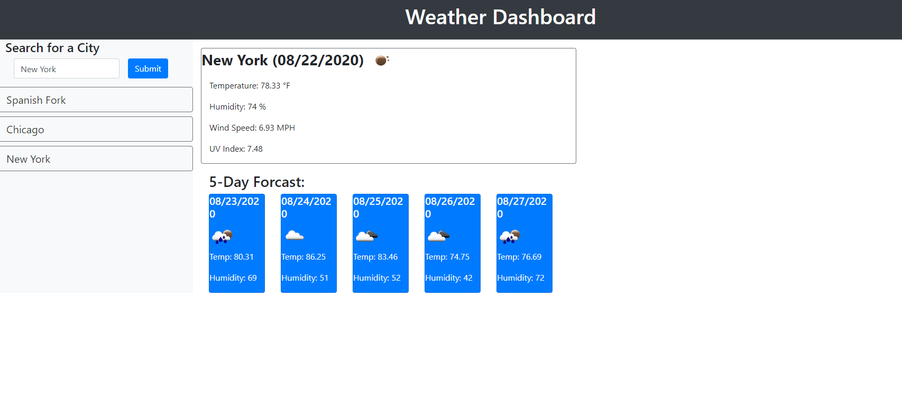
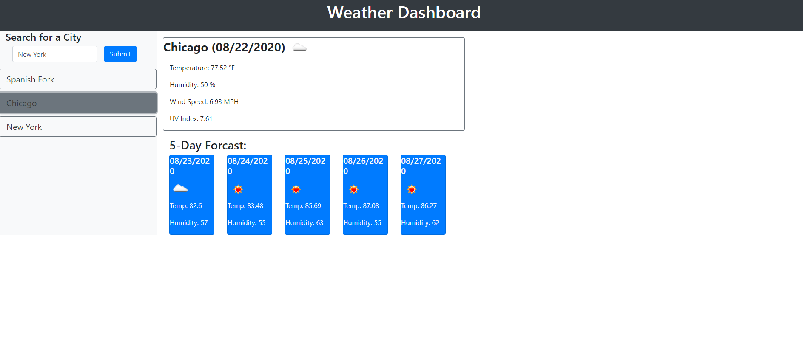

  # Weather Dashboard

  

  ## Table of Contents

  * [Description](#description)
  * [Usage](#usage)
  * [Built-with](#built-with)
  * [License](#license)
  * [Access](#access)
  * [Questions](#questions)
  

  ## Description 

  Travelers often need to know the weather were they are going so that they can plan their trip accordingly. This application allows individuals to get the current weather and the five day outlook for multiple cities.  
  
  
  ## Usage 

  When you are at the home page enter a city name in the search box and hit submit you are then shown the current day forcast and a five day forcast. 

  

  The cities you have previously searched are located in the left hand column. When you click on a city you have previously searched, the forcast information is changed to that city. 

  

  
  ## Built-with

  * HTML
  * JavaScript
  * Moment.js
  * Bootstrap
  
  ## License

  * MIT
  
  ## Access

  * Deployed website: https://siwel20.github.io/weather-dashboard/
  * Link to current repository: https://github.com/siwel20/weather-dashboard

  ## Questions

  * If you have questions you can contact me at plthrock@gmail.com 
